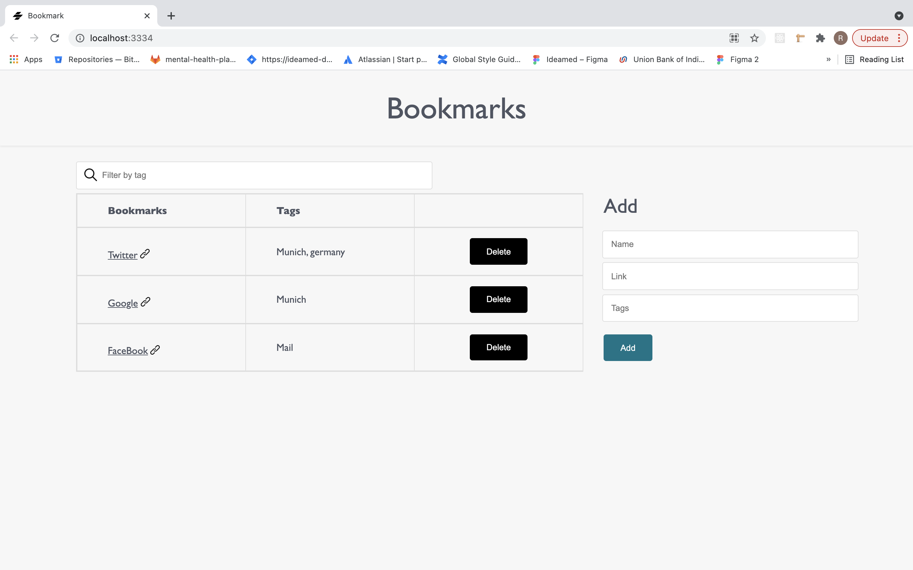

# BookMark

This project was created using Stencil.js with Redux Thunk, can be used to manage bookmarks.

## Available Scripts

In the project directory, you can run:

### `npm run dev`

Runs the app in the development mode. 
Open [http://localhost:3334](http://localhost:3334) to view the FrontEnd on the browser.  

This simultaneously runs the json server. 
Open [http://localhost:8080/bookmarks](http://localhost:8080/bookmarks) to view the JSON on the browser.  

For toast notification 'Sweetalert2' [https://sweetalert2.github.io/](https://sweetalert2.github.io/) is used. 

### `npm run test.watch`

Launches the test runner in the interactive watch mode. 

## Application functionality.

* Allows the user to enter name, link(valid url) and tags. On click of Add button, bookmark is added to the table with a nice confirmation popup.
* The table shows the latest entry on the top.
* The filter field allows the user to filter bookmarks by tags.
* On click of delete button, a popup is displayed to get the confirmation to delete the bookmark.
* On confirming, bookmark gets deleted from the table.

